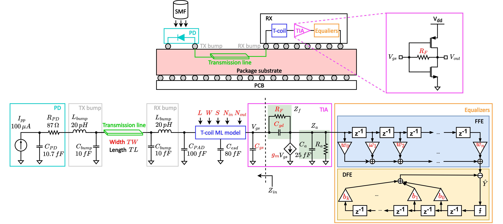

# Optimizing the Photodetector/Analog Front-end Interface in Optical Communication Receivers

- For more info on MMSE-DFE: https://github.com/ChrisZonghaoLi/mmse_dfe
- For more info on UpCNN and t-coil modeling: https://github.com/ChrisZonghaoLi/upcnn
- For more info on plotting statistical eye diagrams: https://github.com/ChrisZonghaoLi/pystateye

The published paper can be found here: https://ieeexplore.ieee.org/document/10227602.

---
Notice: Since I found many editorial mistakes in the original published papers, I decided to revise the paper again and put it on my personal website: https://www.zonghaoli.com/optical_receiver.html. As you may know, the published paper is a part of the scientific record, and correcting your own mistakes and republishing it will be a pain in the ass (which is going to take forever and may result in the paper's rejection). Thus, if you also notice some mistakes, I will correct them and put the new ones on my website.

I have made the following significant changes to the original paper in addition to grammatical mistakes:
- Update the eye diagrams. The original eye diagrams are NOT wrong in a way that it is not symmetric due to the artifact of convolution (boundary effect). Which is inevitable if the vertical bin size is not large enough. This problem is solved by using the brute-force method to find all ISI combinations from the sampled signal. See https://github.com/ChrisZonghaoLi/pystateye for more details.
- Update the GA flow diagram picture to the algorithm block so that it is easy to re-edit.
- Add lots of details regarding the implementation of MMSE-DFE. This is heavily based on Prof. Cioffi's lecture notes\books from Stanford: https://cioffi-group.stanford.edu/doc/book/chap3.pdf, and his paper: https://ieeexplore.ieee.org/document/469441.
  
